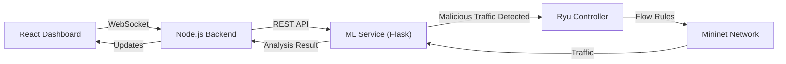
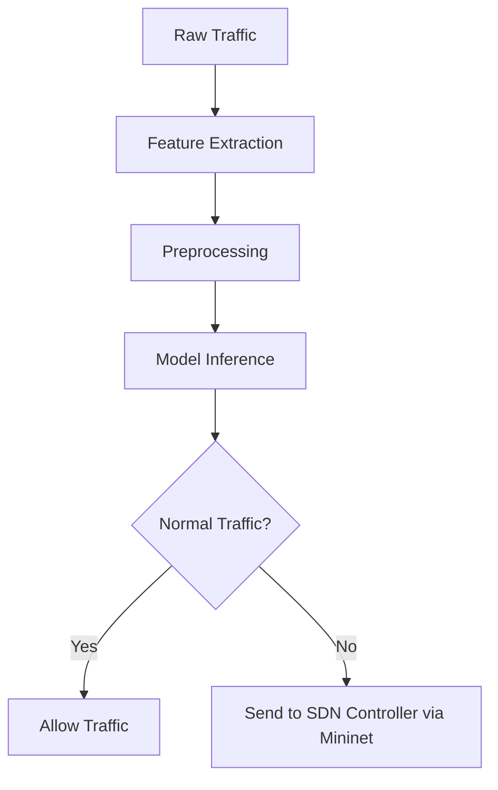
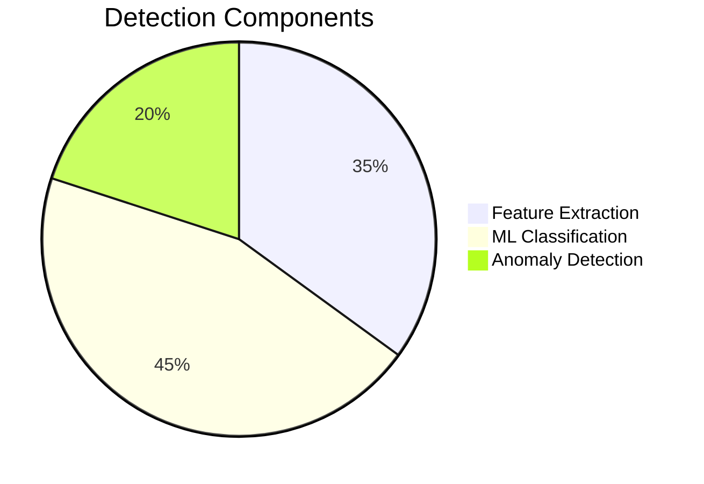
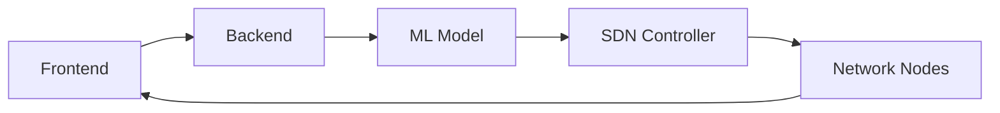
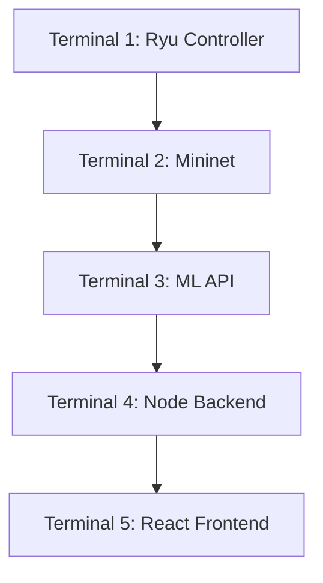
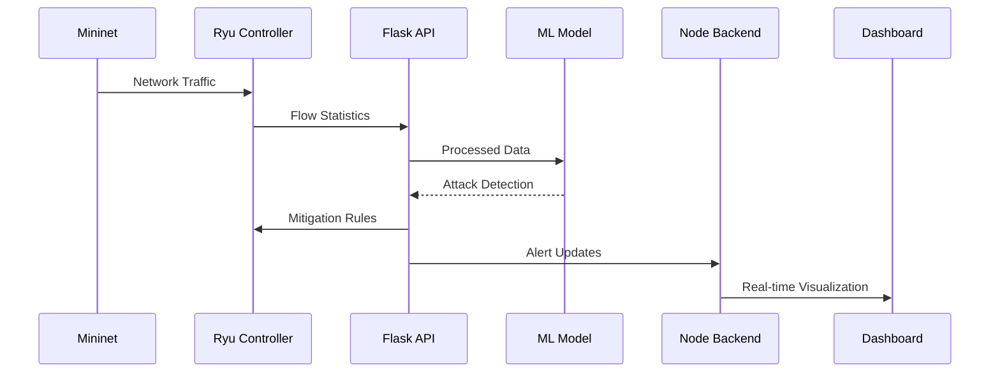

# 🛡️ Sentinel AI – SDN Powered AI-Based DDoS Detection & Mitigation System

A complete end-to-end platform for real-time DDoS detection, SDN-based mitigation, and live traffic visualization, integrating:

- **React** (Frontend Dashboard)
- **Node.js** (Backend Layer + WebSockets)
- **Python Flask** (ML Detection API + SDN Controller Integration)
- **Ryu Controller + Mininet** (SDN Emulation)
- **Locust Load Testing** (DDoS Simulation)

Sentinel AI is designed for 5G and SDN-enabled networks, supporting real-time analytics, anomaly detection, auto-mitigation, and network slicing.

## 📁 Project Folder Structure

```
Sentinel-AI/
│
├── backend/
│   ├── controllers/
│   ├── middleware/
│   ├── routes/
│   ├── socket/
│   ├── tests/
│   ├── utils/
│   ├── .env
│   ├── index.js
│   └── package.json
│
├── frontend/
│   ├── node_modules/
│   ├── public/
│   ├── src/
│   │   ├── components/
│   │   ├── pages/
│   │   ├── api/
│   │   ├── hooks/
│   │   ├── utils/
│   │   └── App.jsx / App.tsx
│   ├── tailwind.config.js
│   ├── vite.config.ts
│   └── package.json
│
├── model/
│   ├── app/
│   │   ├── app.py
│   │   ├── feature_extraction.py
│   │   ├── flow_capture.py
│   │   ├── mitigation_engine.py
│   │   ├── ml_detection.py
│   │   ├── network_slicing.py
│   │   ├── performance_cache.py
│   │   ├── sdn_controller.py
│   │   └── test/
│   ├── models/
│   ├── README.md
│   └── requirements.txt
│
└── Testing/
    ├── locustfile.py
    └── __pycache__/
```

## ⚙️ System Architecture



### Component Interactions

1. **Frontend (React Dashboard)**
   - Captures and visualizes real-time network traffic
   - Sends captured traffic to the backend for analysis
   - Displays detection results and mitigation alerts

2. **Backend (Node.js)**
   - Receives traffic data from the frontend
   - Forwards data to the ML Service for detection
   - Receives detection/mitigation results from ML Service
   - Updates the frontend with analysis and mitigation status

3. **ML Service (Flask)**
   - Receives traffic data from the backend
   - Analyzes traffic for anomalies (normal/malicious)
   - If traffic is normal, sends result back to backend
   - If malicious, sends mitigation request to Ryu Controller via Mininet
   - Receives mitigation response from Ryu Controller
   - Forwards mitigation status/result to backend

4. **Ryu Controller (SDN)**
   - Receives mitigation instructions from ML Service
   - Installs flow rules in Mininet to block/mitigate malicious traffic
   - Sends mitigation response/status to ML Service

5. **Mininet Network**
   - Emulates the SDN environment
   - Forwards traffic and applies flow rules

### Data Flow Sequence

1. **Normal Traffic Flow**
   - Frontend captures network traffic and sends it to the backend.
   - Backend forwards the traffic data to the ML Service.
   - ML Service analyzes the traffic:
     - If traffic is normal, ML Service sends result back to backend.
     - Backend updates the frontend dashboard with the normal status.

2. **DDoS Detection & Mitigation**
   - If ML Service detects malicious traffic:
     - ML Service sends a mitigation request to the Ryu Controller via Mininet.
     - Ryu Controller installs blocking rules in Mininet.
     - Ryu sends mitigation response/status to ML Service.
     - ML Service forwards the mitigation status/result to backend.
     - Backend updates the frontend with mitigation alerts and status.


## 🧠 Machine Learning Pipeline



### Key ML Components
- **Feature Extraction**: Network flow characteristics
- **Anomaly Detection**: Identifies suspicious patterns
- **Classification**: Categorizes traffic as normal or malicious
- **Mitigation Trigger**: Sends malicious traffic to SDN Controller via Mininet for mitigation

## 🧩 Key Features

### 🔍 AI-Powered DDoS Detection

- Machine Learning classifier (Random Forest / Sklearn)
- Real-time feature extraction
- Flow-based detection

### 📡 SDN-Controlled Mitigation
- Ryu + OpenFlow 1.3
- Dynamic blocking of malicious IPs
- Flow-table manipulation

### 📊 Live Dashboard
- Real-time traffic visualization
- Threat alerts and notifications
- Flow table monitoring
- Network slice analytics (eMBB, URLLC, mMTC)

### 🔥 DDoS Simulation
- Locust-based traffic generator
- Custom attack scenarios
- Real-time impact analysis

### 🧪 Full Integration Pipeline

- End-to-end automation
- Real-time feedback loop
- Scalable architecture

## 🚀 Installation

### 1️⃣ Clone Repository
```bash
git clone <https://github.com/Akshita3104/Sentinel-AI.git>
cd Sentinel-AI
```

## 🖥 Running the Entire Workflow (5-Terminal Setup)

This is the correct & final execution order.

### Terminal Setup Overview



### ▶ Terminal 1 — Start Ryu SDN Controller

```bash
# Connect to Mininet VM
ssh mininet@192.168.56.101

# Start Ryu Controller
ryu-manager ryu.app.simple_switch_13 ryu.app.ofctl_rest
```

### ▶ Terminal 2 — Start Mininet Topology

```bash
# Connect to Mininet VM
ssh mininet@192.168.56.101

# Start Mininet with custom topology
sudo mn --topo single,3 --mac --switch ovsk \
--controller=remote,ip=127.0.0.1,port=6633

# Test network connectivity
pingall
```

### ▶ Terminal 3 — Start ML Detection API

```bash
# Navigate to ML application
cd model/app

# Start the Flask API
python app.py
```

> **API Documentation**: [http://127.0.0.1:5001](http://127.0.0.1:5001)

### ▶ Terminal 4 — Start Node Backend

```bash
# Navigate to backend directory
cd backend

# Start the Node.js server
nodemon index.js
```

> **Backend API**: [http://localhost:3000](http://localhost:3000)

### ▶ Terminal 5 — Start React Dashboard

```bash
# Navigate to frontend directory
cd frontend

# Install dependencies (first time only)
npm install

# Start the development server
npm run dev
```

> **Dashboard URL**: [http://localhost:5173](http://localhost:5173)

## 💣 DDoS Attack Simulation

### Launching the Attack

```bash
# Navigate to testing directory
cd Testing

# Start Locust with the test scenario
locust -f locustfile.py
```

### Accessing Locust Web Interface
Open your browser and navigate to: [http://localhost:8089](http://localhost:8089)

### Configuring the Attack
1. **Number of users**: Total concurrent users
2. **Spawn rate**: Users spawned per second
3. **Host**: `http://<your-backend-address>:3000`

### Monitoring the Attack
```bash
# Check SDN switch flow table (in a new terminal)
curl http://127.0.0.1:8080/stats/flow/1 | python -m json.tool
```

### Attack Workflow



### Expected Outcomes
- Real-time attack detection in the dashboard
- Automatic mitigation through SDN rules
- Visual representation of attack patterns
- Performance metrics and system health monitoring
4. If attack:
       - mitigation_engine.py triggers SDN rules
5. Flask notifies Node backend
6. Backend pushes live alerts → Frontend (Socket.IO)
7. Dashboard updates traffic charts + alerts


Everything works in a continuous real-time feedback loop.

## 🚨 Troubleshooting

### Clean Mininet Environment
```bash
# Clear Mininet configuration
sudo mn -c
```

### Kill Blocked Ports
```bash
# Kill processes on commonly used ports
sudo fuser -k 6633/tcp  # OpenFlow
sudo fuser -k 8080/tcp  # Ryu Web Interface
sudo fuser -k 5001/tcp  # Flask API
```

### Common Issues
- **Port already in use**: Use the kill commands above
- **Permission denied**: Prepend commands with `sudo` if needed
- **Dependency issues**: 
  ```bash
  # For Node.js
  rm -rf node_modules package-lock.json
  npm cache clean --force
  npm install
  
  # For Python
  pip freeze > requirements.txt
  pip install -r requirements.txt --upgrade
  ```

### System Requirements
- Node.js v14+
- Python 3.8+
- Mininet 2.3+
- Ryu 4.34+
