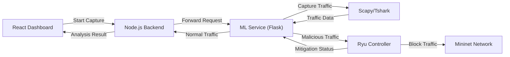
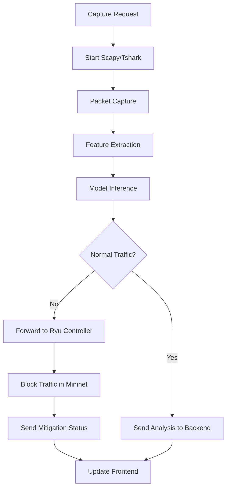
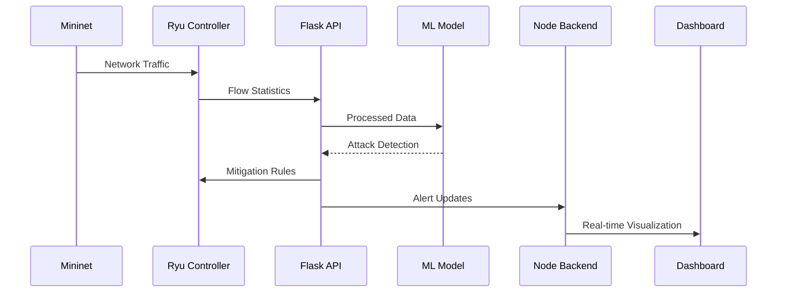
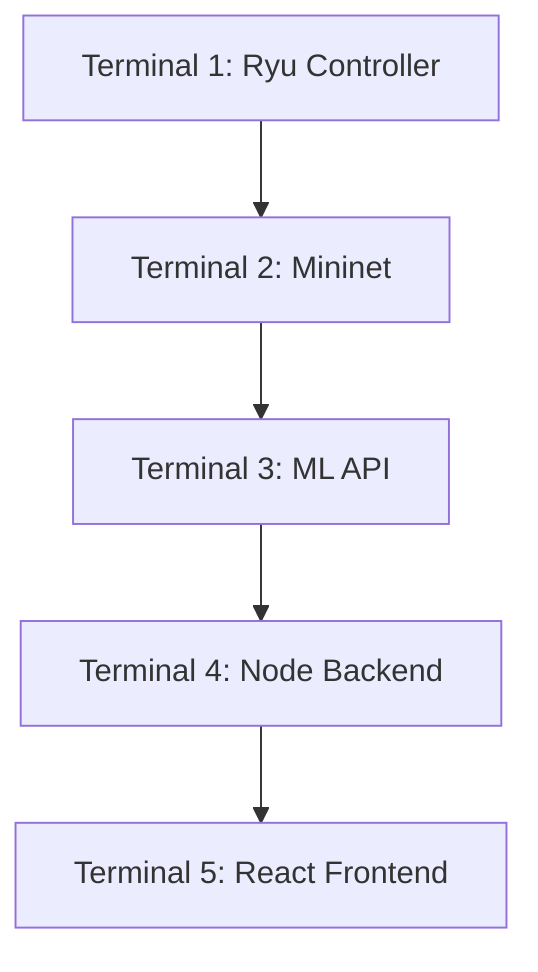

# 🛡️ Sentinel AI – SDN Powered AI-Based DDoS Detection & Mitigation System

A complete end-to-end platform for real-time DDoS detection, SDN-based mitigation, and live traffic visualization, integrating:

- **React** (Frontend Dashboard)
- **Node.js** (Backend Layer + WebSockets)
- **Python Flask** (ML Detection API + SDN Controller Integration)
- **Ryu Controller + Mininet** (SDN Emulation)
- **Locust Load Testing** (DDoS Simulation)

Sentinel AI is designed for 5G and SDN-enabled networks, supporting real-time analytics, anomaly detection, auto-mitigation, and network slicing.

## 📁 Project Folder Structure

```
Sentinel-AI/
│
├── backend/
│   ├── controllers/
│   ├── middleware/
│   ├── routes/
│   ├── socket/
│   ├── tests/
│   ├── utils/
│   ├── .env
│   ├── index.js
│   └── package.json
│
├── frontend/
│   ├── node_modules/
│   ├── public/
│   ├── src/
│   │   ├── components/
│   │   ├── pages/
│   │   ├── api/
│   │   ├── hooks/
│   │   ├── utils/
│   │   └── App.jsx / App.tsx
│   ├── tailwind.config.js
│   ├── vite.config.ts
│   └── package.json
│
├── model/
│   ├── app/
│   │   ├── app.py
│   │   ├── feature_extraction.py
│   │   ├── flow_capture.py
│   │   ├── mitigation_engine.py
│   │   ├── ml_detection.py
│   │   ├── network_slicing.py
│   │   ├── performance_cache.py
│   │   ├── sdn_controller.py
│   │   └── test/
│   ├── models/
│   ├── README.md
│   └── requirements.txt
│
└── Testing/
    ├── locustfile.py
    └── __pycache__/
```

## ⚙️ System Architecture



### Component Interactions

1. **Frontend (React Dashboard)**
   - Initiates traffic capture requests
   - Displays real-time traffic analysis results
   - Shows mitigation alerts and network status
   - Visualizes real-time network traffic

2. **Backend (Node.js)**
   - Receives capture requests from frontend
   - Forwards requests to ML Service
   - Relays analysis results and mitigation status to frontend
   - Manages WebSocket connections for real-time updates

3. **ML Service (Flask)**
   - Receives capture requests from backend
   - Uses Scapy/Tshark for packet capture and analysis
   - Performs real-time traffic classification (normal/malicious)
   - For normal traffic: Sends analysis results back to backend
   - For malicious traffic: Forwards to Ryu Controller via Mininet
   - Processes Ryu's mitigation response and updates backend

4. **Scapy/Tshark Integration**
   - Captures live network traffic
   - Extracts relevant packet features
   - Provides real-time traffic data to ML Service

5. **Ryu Controller (SDN)**
   - Receives malicious traffic alerts from ML Service
   - Implements flow rules to block malicious traffic in Mininet
   - Sends mitigation confirmation/status back to ML Service

6. **Mininet Network**
   - Emulates the SDN environment
   - Applies flow rules from Ryu Controller
   - Forwards legitimate traffic while blocking malicious flows

### Data Flow Sequence

1. **Traffic Capture Initiation**
   - Frontend sends capture request to backend
   - Backend forwards request to ML Service
   - ML Service initializes Scapy/Tshark for packet capture

2. **Traffic Analysis Flow**
   - Scapy/Tshark captures and analyzes network packets
   - Extracted traffic features are sent to ML Service
   - ML model classifies traffic as normal or malicious

3. **Normal Traffic Handling**
   - If traffic is classified as normal:
     - ML Service sends analysis results to backend
     - Backend updates frontend with traffic statistics
     - Dashboard displays normal traffic visualization

4. **Malicious Traffic Mitigation**
   - If traffic is classified as malicious:
     - ML Service forwards alert to Ryu Controller via Mininet
     - Ryu Controller implements flow rules to block malicious traffic
     - Ryu sends mitigation confirmation to ML Service
     - ML Service forwards status update to backend
     - Backend notifies frontend about the attack and mitigation
     - Dashboard updates with security alerts and blocked traffic info


## 🧠 Traffic Processing Pipeline



### Key Components
- **Packet Capture**: Real-time traffic monitoring using Scapy/Tshark
- **Feature Extraction**: Network flow characteristics and packet analysis
- **ML Classification**: Categorizes traffic as normal or malicious
- **SDN Integration**: Seamless communication with Ryu Controller
- **Real-time Updates**: WebSocket-based status updates to frontend
- **Mitigation Engine**: Automated response to detected threats

### Attack Workflow



### Expected Outcomes
- Real-time attack detection in the dashboard
- Automatic mitigation through SDN rules
- Visual representation of attack patterns
- Performance metrics and system health monitoring
4. If attack:
       - mitigation_engine.py triggers SDN rules
5. Flask notifies Node backend
6. Backend pushes live alerts → Frontend (Socket.IO)
7. Dashboard updates traffic charts + alerts


Everything works in a continuous real-time feedback loop.

## 🧩 Key Features

### 🔍 DDoS Detection
- Machine Learning classifier (Random Forest / Sklearn)
- Real-time feature extraction
- Flow-based detection

### 📡 SDN-Controlled Mitigation
- Ryu + OpenFlow 1.3
- Dynamic blocking of malicious IPs
- Flow-table manipulation

### 📊 Live Dashboard
- Real-time traffic visualization
- Threat alerts and notifications
- Flow table monitoring
- Network slice analytics (eMBB, URLLC, mMTC)

### 🔥 DDoS Simulation
- Locust-based traffic generator
- Custom attack scenarios
- Real-time impact analysis

## 🚀 Installation

### 1️⃣ Clone Repository
```bash
git clone <https://github.com/Akshita3104/Sentinel-AI.git>
cd Sentinel-AI
```

## 🖥 Running the Entire Workflow (5-Terminal Setup)

This is the correct & final execution order.

### Terminal Setup Overview



### ▶ Terminal 1 — Start Ryu SDN Controller

```bash
# Connect to Mininet VM
ssh mininet@192.168.56.101

# Start Ryu Controller
ryu-manager ryu.app.simple_switch_13 ryu.app.ofctl_rest
```

### ▶ Terminal 2 — Start Mininet Topology

```bash
# Connect to Mininet VM
ssh mininet@192.168.56.101

# Start Mininet with custom topology
sudo mn --topo single,3 --mac --switch ovsk \
--controller=remote,ip=127.0.0.1,port=6633

# Test network connectivity
pingall
```

### ▶ Terminal 3 — Start ML Detection API

```bash
# Navigate to ML application
cd model/app

# Start the Flask API
python app.py
```

> **API Documentation**: [http://127.0.0.1:5001](http://127.0.0.1:5001)

### ▶ Terminal 4 — Start Node Backend

```bash
# Navigate to backend directory
cd backend

# Start the Node.js server
nodemon index.js
```

> **Backend API**: [http://localhost:3000](http://localhost:3000)

### ▶ Terminal 5 — Start React Dashboard

```bash
# Navigate to frontend directory
cd frontend

# Install dependencies (first time only)
npm install

# Start the development server
npm run dev
```

> **Dashboard URL**: [http://localhost:5173](http://localhost:5173)

## 💣 DDoS Attack Simulation

### Launching the Attack

```bash
# Navigate to testing directory
cd Testing

# Start Locust with the test scenario
locust -f locustfile.py
```

### Accessing Locust Web Interface
Open your browser and navigate to: [http://localhost:8089](http://localhost:8089)

### Configuring the Attack
1. **Number of users**: Total concurrent users
2. **Spawn rate**: Users spawned per second
3. **Host**: `http://<your-backend-address>:3000`

### Monitoring the Attack
```bash
# Check SDN switch flow table (in a new terminal)
curl http://127.0.0.1:8080/stats/flow/1 | python -m json.tool
```


## 🚨 Troubleshooting

### Clean Mininet Environment
```bash
# Clear Mininet configuration
sudo mn -c
```

### Kill Blocked Ports
```bash
# Kill processes on commonly used ports
sudo fuser -k 6633/tcp  # OpenFlow
sudo fuser -k 8080/tcp  # Ryu Web Interface
sudo fuser -k 5001/tcp  # Flask API
```

### Common Issues
- **Port already in use**: Use the kill commands above
- **Permission denied**: Prepend commands with `sudo` if needed
- **Dependency issues**: 
  ```bash
  # For Node.js
  rm -rf node_modules package-lock.json
  npm cache clean --force
  npm install
  
  # For Python
  pip freeze > requirements.txt
  pip install -r requirements.txt --upgrade
  ```

### System Requirements
- Node.js v14+
- Python 3.8+
- Mininet 2.3+
- Ryu 4.34+
